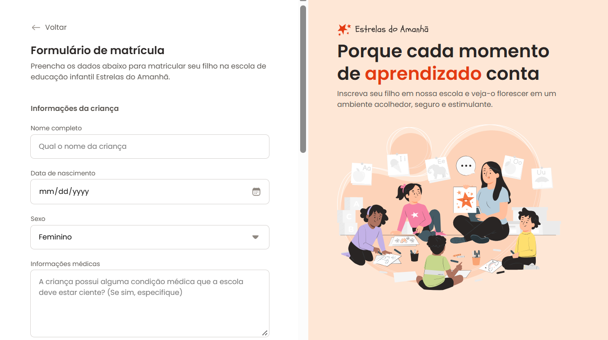

<h1 align="center"> 📑 Projeto Formulário de Matrícula </h1>

O <strong>Formulário de Matrícula – Estrelas do Amanhã</strong> é um projeto de desenvolvimento web voltado para a prática de formulários e usabilidade.  
O objetivo é simular um sistema de inscrição escolar, onde pais e responsáveis podem preencher os dados da criança, endereço, contatos e opções de matrícula.  
Este projeto consolida meus estudos em <strong>HTML e CSS</strong>, explorando a construção de formulários completos, responsivos e acessíveis.

  <a href="#-tecnologias">Tecnologias</a>&nbsp;&nbsp;&nbsp;|&nbsp;&nbsp;&nbsp;
  <a href="#-projeto">Projeto</a>&nbsp;&nbsp;&nbsp;|&nbsp;&nbsp;&nbsp;
  <a href="#-estrutura-do-projeto">Estrutura</a>&nbsp;&nbsp;&nbsp;|&nbsp;&nbsp;&nbsp;
  <a href="#-layout">Layout</a>

  

## 🚀 Tecnologias

Esse projeto foi desenvolvido com as seguintes tecnologias:

- **HTML5**
- **CSS3**
- **Google Fonts (Poppins)**
- **SVGs customizados** (ícones e ilustrações)

## 💻 Projeto

No desenvolvimento do formulário foram praticados os seguintes conceitos:

- Estruturação semântica em HTML  
- Uso de **fieldsets**, **labels** e **inputs** para acessibilidade  
- Criação de **componentes customizados** (inputs, checkboxes, radios e área de upload de arquivo)  
- Validação visual de campos obrigatórios (ex: e-mail)  
- Estilização com **CSS responsivo**  
- Integração de tipografia via **Google Fonts**  

O formulário é dividido em seções:  

- **Informações da criança**  
- **Endereço residencial**  
- **Informações do responsável**  
- **Opções de matrícula (turno e esportes)**  
- **Aceite dos termos**  

## 🔖 Layout

O layout foi inspirado em páginas modernas de inscrição escolar, com foco em clareza, organização e acolhimento visual.  

---

Feito com ♥ por **Bruno Ackciel Catizane** ✨